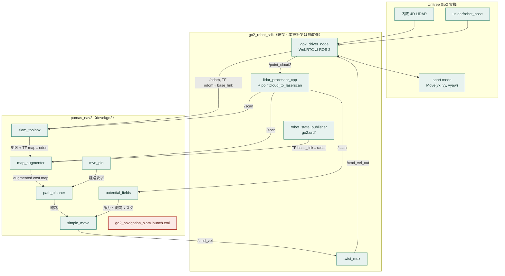

# Unitree Go2 への pumas_nav2 導入

| 項目 | 内容 |
|---|---|
| ステータス | ドラフト（レビュー待ち） |
| 作成日 | 2026-08-31 |
| 対象リポジトリ | `Hibikino-Musashi-Home/pumas_nav2`（ブランチ `devel/go2` を新設） |
| 関連セッション | LiDAR / `/scan` 生成系は別セッション（herdr w3）が並行検証中 |

## 構成

| ページ | 位置づけ |
|---|---|
| **README.md（本書）** | 設計文書の本体。背景・全体設計・作るものの範囲・代替案・未解決の問い |
| [01-parameters.md](01-parameters.md) | 付録A: HSR → Go2 のパラメータ対応表と各値の根拠 |
| [02-launch-and-code.md](02-launch-and-code.md) | 付録B: 追加する launch とコード変更の詳細設計 |
| [03-verification.md](03-verification.md) | 付録C: 検証手順書と実機計測項目 |

---

## 1. 背景と目的

Unitree Go2 を屋内で自律移動させたい。ナビゲーションスタックの候補として、
Hibikino-Musashi@Home（以下 HMA）が RoboCup@Home で実運用している `pumas_nav2` を採用できるか
を検討した。

`pumas_nav2` は UNAM BioRobotics の `pumas_navigation`（ROS 1）を起源とし、
`ARTenshi/robot_navigation` を経て ROS 2 化されたスタックで、RoboCup@Home の
Smoothest, Safest Navigation Award を 2022〜2025 年に連続受賞している。
HMA では Toyota HSR（全方向移動台車）で運用されている。

**採用したい理由は、HMA 側のタスク実行系をそのまま Go2 に持ち込めること**である。
`navlib` によるゴール指定、`/pumas_nav` アクション、家具ポリゴンレイヤ、禁止領域といった
既存資産は `pumas_nav2` の存在を前提としており、ナビゲーションだけ別スタックにすると
接続部を作り直すことになる。

一方で、**Go2 のような四足歩行ロボットへの移植事例は upstream にも全 fork にも存在しない**
（リポジトリ全体を `quadruped` / `go2` / `unitree` で検索してヒット 0）。
本設計は「動くはず」という設計上の見込みを、**具体的なギャップとその埋め方に分解する**ことを目的とする。

### 本設計のスコープ

- **含む**: `pumas_nav2` を Go2 で起動し、SLAM しながら自律移動させるまでの設計
- **含まない**: `/scan` を正しく生成するまでの `go2_ros2_sdk` 側の修正（別セッション担当、§5 に契約を記載）
- **含まない**: 有線 DDS 経路の整備（`unitree_ros2` 導入）。今回は WebRTC 経路のみ

---

## 2. 用語

| 用語 | 意味 |
|---|---|
| **pumas_nav2** | 本設計で導入するナビゲーションスタック。地図拡張・経路計画・障害物回避・パス追従を担当し、**SLAM と自己位置推定は行わない** |
| **map_augmenter** | 静的地図に LiDAR / 点群由来の動的障害物を重畳した「augmented map」を作るノード。他スタックのコストマップに相当。サービスで地図を提供する |
| **path_planner** | augmented map 上で A\* により大域経路を作るノード。サービス型 |
| **potential_fields** | 斥力ポテンシャル場による局所回避。前方の検知ボックス内の点から `collision_risk` と斥力ベクトルを出す |
| **simple_move** | パス追従と速度指令の生成。**`/cmd_vel` を出す唯一のノード** |
| **mvn_pln** | 上位の状態機械。`/pumas_nav` アクションサーバとしてゴールを受け、再計画・リカバリ・収束監視を行う |
| **検知ボックス** | `potential_fields` / `map_augmenter` が障害物とみなす範囲。ロボット前方の直方体で、`laser_min_x`〜`laser_max_z` の 6 値で定義する。**多角形フットプリントという概念は pumas には無い** |
| **ユニサイクル制御** | 前進速度と旋回速度（vx, wz）だけで動かす制御。差動二輪ロボットの標準 |
| **holonomic 制御 / omni 制御** | 横方向速度 vy も同時に使う制御。HSR の全方向台車が前提。pumas ではゴール直前（last-mile）で切り替わる |
| **WebRTC 経路** | Go2 と無線で接続し、`go2_robot_sdk` が ROS 2 トピックに変換する経路。**ナビゲーションで使えるのはこちら** |
| **有線 DDS 経路** | Go2 の内蔵 DDS に直結する経路。帯域・遅延は有利だが `unitree_go` メッセージ定義が未導入で ROS 2 から型が解決できない |
| **base_link / base_footprint** | ロボット本体の基準フレーム。一般に `base_footprint` は接地面に置くが、**Go2 の URDF では両者が同一位置**（§4.1） |
| **radar** | Go2 の URDF における LiDAR フレームの名前。`lidar_link` ではない |
| **twist_mux** | 複数の速度指令を優先度で調停するノード。Go2 では joy（優先度 10）> navigation（優先度 5） |

---

## 3. 全体設計

### 3.1 システム構成



図1: システム構成。**赤枠が本設計で新規に書くもの**。pumas_nav2 の各ノードも
go2_robot_sdk の各ノードも既存であり、**新規に書くのは Go2 用の launch 1 本だけ**である
（これに加えてコード変更が 1 箇所。§4.3）。

### 3.2 責務の分担

`pumas_nav2` は SLAM も自己位置推定も行わない。`map → odom` は `slam_toolbox` が、
`odom → base_link` は `go2_driver_node` が出す。pumas は与えられた地図と自己位置の上で
「障害物を重畳し、経路を引き、追従する」ことだけを担当する。

速度指令の出口は `simple_move` ただ一つで、`/cmd_vel` は twist_mux の navigation 入力
（優先度 5）に接続する。ジョイスティック（優先度 10）が常に優先されるため、
**手動で割り込んで停止させられる**。これを一次的な安全装置として使う。

---

## 4. 何が既にあり、何を作るのか

### 4.1 一覧

| コンポーネント | どこにある | 役割 | 本設計での扱い |
|---|---|---|---|
| `map_augmenter`, `path_planner`, `mvn_pln` | pumas_nav2 | 地図拡張・経路計画・状態機械 | **既存**（パラメータのみ変更） |
| `potential_fields` | pumas_nav2 | 反応的な障害物回避 | **コード変更**（LaserScan 購読の QoS。§5.2） |
| `simple_move` | pumas_nav2 | パス追従・`/cmd_vel` 生成 | **コード変更**（横速度の上限パラメータ追加。§4.3） |
| `hardware_controller`, `motion_synth`, `human_follower` | pumas_nav2 | HSR のアーム・ヘッド・人追従 | **既存**（ビルドはするが起動しない） |
| `go2_navigation_slam.launch.xml` | pumas_nav2 `navigation_start/launch/` | Go2 用の起動定義 | **★新規** |
| `go2_driver_node`, `lidar_processor_cpp`, `twist_mux`, `robot_state_publisher` | go2_robot_sdk | Go2 実機との入出力 | **既存**（本設計では無改造。§5 の契約のみ要求） |
| `slam_toolbox` | コンテナ導入済み | SLAM と `map → odom` | **既存**（設定のみ） |
| `nav2_map_server`, `nav2_lifecycle_manager` | コンテナ導入済み | 禁止地図の配信 | **既存**（設定のみ） |
| コンテナ実行環境 | サイト側 | 実行環境 | **変更なし**（§4.2 で後述） |

**新規に書くのは launch 1 本のみ**であり、コード変更は `simple_move` の 1 箇所に限る。
これが本設計の中心的な主張である。

### 4.2 層ごとの変更

| 層 | 変更内容 |
|---|---|
| **実行環境（コンテナ）** | **C++ ノードについては変更なし。** ビルドと起動を実機なしで確認済み（§4.4）。`rtabmap` のみ無いが本設計では使わない。**ただし Python クライアント層のために `transforms3d` の更新が 1 つ必要**（§4.7） |
| **ワークスペース構成** | Go2 のワークスペースに `pumas_nav2` を追加する |
| **アルゴリズム（pumas ノード群）** | `simple_move` に横速度の上限パラメータを追加するのみ。他ノードは**変更なし** |
| **ROS インターフェース（トピック・TF）** | `/cmd_vel` を twist_mux の navigation 入力に接続。全ノードの基準フレームを `base_link` に統一。`/scan` の生成は別セッション担当 |
| **データ（地図・パラメータ）** | 静的地図は使わない（SLAM のため）。禁止地図は pumas 同梱の `blank` を流用。家具ポリゴン yaml は用意せず無効化。Go2 用のパラメータは launch に記述する |

### 4.3 `simple_move` へのコード変更

Go2 の横歩きは車輪式の全方向台車より遅く、滑りやすい。しかし pumas には
**横速度だけを独立に制限する仕組みが無い**。

- ユニサイクル制御では、斥力が `linear.y` を**上書き**する（`simple_move_node.cpp:738`）
- last-mile omni 制御では、vx と vy の**合成ノルム**でしか飽和しない（同 `:791-828`）

そのため `max_lateral_speed` パラメータを新設し、`/cmd_vel` を publish する直前で
`linear.y` を独立にクランプする。既定値を「制限なし」相当にすれば HSR の挙動は変わらないため、
**upstream に還元しやすい**変更になる。

もう 1 箇所、`potential_fields` の LaserScan 購読の QoS を修正した（C2）。
理由と影響は §5.2 に記す。こちらも HSR の挙動を変えない。

詳細はいずれも [02-launch-and-code.md](02-launch-and-code.md)。

---

### 4.4 実測: ビルドと起動の確認（2026-08-31）

実機を接続しない状態で、以下を確認した。

| 確認 | 結果 |
|---|---|
| `colcon build --packages-up-to pumas_nav2` | **成功。** 13 パッケージ、27.8 秒。エラーなし（警告のみ） |
| `go2_navigation_slam.launch.xml` の起動 | **成功。** 下記 10 ノードが起動した |
| `/pumas_nav` アクションの公開 | **公開された**（§7 の Q6 が解決） |

起動したノード: `slam_toolbox`, `prohibition_map_server`, `lifecycle_manager_map`,
`map_enhancer`, `map_augmenter`, `path_planner`, `simple_move`, `potential_fields`,
`publish_enable`, `mvn_pln`, `dynamic_param_rw_server`。

`map_augmenter` が「Services not ready」を出すのは、地図がまだ無い状態では想定どおりである。

これにより「コンテナに依存が全て揃っている」「新規に書くのは launch 1 本」という
本設計の中心的な主張が実証された。

### 4.5 実測: 合成センサによる閉ループ検証（2026-08-31）

実機が使えない間、Go2 の代わりに運動学シミュレータ（`fake_go2.py`）を立てて
パイプライン全体を閉ループで回した。シミュレータは受け取った `/cmd_vel` を積分して
TF `odom → base_link` と `/odom` を出し、実機と同じ形の `/scan`
（360 度・15 Hz・`frame_id=base_link`・**BEST_EFFORT**）を合成する。

| 確認項目 | 結果 |
|---|---|
| 状態機械の遷移 | `WAITING_FOR_TASK` → `CALCULATE_PATH` → `WAIT_FOR_PATH_RESPONSE` → `ENABLE_POT_FIELDS` → `WAIT_FOR_POT_FIELDS` → `START_MOVE_PATH` |
| ゴール到達 | **成功。** `outcome: 1`（`OUTCOME_GOAL_REACHED`）、`success: true` |
| 走行 | (0, 0) から map(2.5, −1.5) へ。柱を回避して到達 |
| パラメータの反映 | `max_lateral_speed=0.1`, `max_linear_speed=0.5`, `base_link_name=base_link`, `inflation_radius=0.32` |
| `slam_toolbox` | 地図と TF `map → odom` を生成 |
| `map_augmenter` | `/augmented_map` を生成 |

**横速度クランプ（C1）の検証**

| `max_lateral_speed` | 観測された `peak\|vy\|` |
|---|---|
| 0.30 | 0.15（自然値。制限に達していない） |
| 0.10 | **0.10（頭打ち）** |

制限値を下げたときだけ頭打ちになることから、クランプが実際に効いていることが確認できた。
`peak|vx|` は 0.51 で `max_linear_speed=0.5` と整合する。

**RViz 経路での確認（`transforms3d` 修正後）**

`/move_base_simple/goal` に PoseStamped を投げ、`pumas_viz_goal_bridge` 経由で
`/pumas_nav` に橋渡しされる経路（RViz の 2D Nav Goal と同じ）も通した。

```
result: success=True, outcome=GOAL_REACHED, near_goal_reached=True,
        message=Global goal point reached
```

最終盤で `WAIT_FOR_ANGLE_CORRECTED`（ゴール姿勢への寄せ）を経て `FINAL` に至っており、
last-mile の holonomic 制御まで含めて動作している。

**注意**: 検証は運動学モデルであり、四足の歩行力学・滑り・胴体の上下動は含まない。
追従性そのものの評価は実機でなければできない。

### 4.6 実測: 床面の高さと脚の写り込み（2026-08-31、実機）

`base_ground` が動き始めたあと、実機で 2 点を計測した。

#### 床面の位置（Q12）

`/point_cloud2`（odom 座標）から、水平距離 1.0 m より遠い点だけを取り出して
z のヒストグラムを作った（自機の胴体と脚を除くため）。

```
  -0.23   1752 #
  -0.18  17499 #################
  -0.13  50977 ##################################################
  -0.08  30139 #############################
```

**床面は z = −0.125 m。** 4 秒間隔で 2 回測って差は 0.0 cm、完全に安定している。
点群の z は 0.05 m 刻みに量子化されているため、精度は ±0.025 m。

**したがって `ground_z` の既定値 0 は 12.5 cm ずれている。**

| | 現状（`ground_z=0`） | あるべき値（`ground_z=-0.125`） |
|---|---|---|
| `base_ground` の位置 | 実際の床より **12.5 cm 上** | 床の上 |
| `min_height: 0.10` の実効高さ | 床から **0.225 m** | 床から 0.10 m |
| 帰結 | **高さ 22 cm 未満の障害物が `/scan` に出ない** | 意図どおり |

`odom` は固定された世界座標系であり、床面の z は姿勢によらず一定であることが
計測で裏づけられた。`ground_z` を定数で与える方式は正しい。

#### 脚の写り込み（Q3）

`/scan` の有効リターン 3191 件（5 フレーム）のうち、**0.5 m 未満は 0 件**。
自機の脚は `/scan` に入っていない。`range_min: 0.20` と高さ帯の組み合わせで
既に除外できている。

当初「四足特有の最大のチューニングポイント」と見ていた問題は、
`base_ground` と `pointcloud_to_laserscan` の高さ帯によって解消した。
残る調整は `ground_z` の 1 値のみである。

### 4.7 環境の不整合: `transforms3d` と `numpy`

コンテナの apt 版 `python3-transforms3d` は 0.3.1 で、内部で `np.maximum_sctype(np.float)`
を呼ぶ。しかし同じ環境の `numpy` は 1.26.4 であり、`np.float` は削除済みである。
このため `tf_transformations` の import が失敗する。

**影響範囲は Python クライアント層に限られる。**

| 対象 | 影響 |
|---|---|
| `navigation_tools/navlib.py` | import できない。上位からゴールを送る API が使えない |
| `navigation_tools/pumas_viz_goal_bridge.py` | 起動時に落ちる。**RViz の 2D Nav Goal でゴールを指定できない** |
| C++ ノード群（`map_augmenter` ほか） | **影響なし。**正常に動作している |

**対処（2026-08-31、実施済み）**

```bash
pip install --no-deps "transforms3d==0.4.2"
```

Python 環境側がシステム側（apt）を隠すため、apt パッケージには手を触れない。

**`--no-deps` は必須である。** これが無いと pip が `numpy` を 2.x に上げうるが、
numpy 2.x では `av` が `_ARRAY_API not found` で壊れ、WebRTC の映像トラックが作れず
**SDP 交渉が失敗して接続自体ができなくなる**（別セッションによる実測）。
`numpy` は 1.26.4 に固定しなければならない。

**回帰確認**

| 項目 | 結果 |
|---|---|
| `numpy` | 1.26.4（変化なし） |
| `av` | 12.3.0、import 成功 |
| `transforms3d` | 0.4.2、Python 環境側から解決 |
| `tf_transformations` | import 成功 |
| `navigation_tools/navlib.py` | import 成功 |
| `pumas_viz_goal_bridge.py` | 起動成功（`RvizGoalBridge started`） |

これは `pumas_nav2` 側の問題ではなく実行環境側の問題であり、
`tf_transformations` を使う他のパッケージにも同様に影響していた。

---

## 5. 前提となる外部条件（herdr w3 セッションとの境界）

**2026-08-31、別セッションの実機検証により全条件が満たされた。**

| # | 条件 | 状態 |
|---|---|---|
| 1 | `/scan` が `sensor_msgs/LaserScan` で、`frame_id` が実際に TF 変換された `base_link` である | **達成。** 15.1 Hz |
| 2 | `/scan` が購読側に届く | **達成。**ただし QoS の扱いに注意（§5.2） |
| 3 | TF `odom → base_link` が連続して流れる | **達成** |
| 4 | TF `base_link → radar` が静的に引ける | **達成** |
| 5 | `/point_cloud2` を第2の障害物入力として使う | 本設計では使わない |

実測レート（Wi-Fi / WebRTC、有線 LAN を物理的に外した状態）:
`/point_cloud2` 15.4 Hz（約 62,000 点）、`/scan` 15.1 Hz、`/odom` 37.6 Hz、`/joint_states` 38.4 Hz。

### 5.1 `/scan` の生成経路

当初は `lidar_processor_cpp` が座標変換せずに `frame_id` を書き換えている点が
問題になると見ていた。実際の構成はその経路を通らない。

```
/point_cloud2 (frame_id=odom, BEST_EFFORT)
  → pointcloud_to_laserscan (target_frame=base_link)
  → /scan (frame_id=base_link, BEST_EFFORT)
```

`pointcloud_to_laserscan` が TF による変換を行うため、`lidar_processor_cpp` を
経路から外すだけで問題が解消している。設定は
Go2 の bringup 層が持つ `pointcloud_to_laserscan` の設定。

**この構成には、pumas 側のパラメータに直接効く性質がある。**
`LaserScan` は平面上のデータであり、`target_frame` が `base_link` である以上、
`/scan` の全点は **`base_link` 座標系の z = 0 平面に載る**。したがって:

- pumas の `laser_min_z` / `laser_max_z` は **0 を跨いでいなければならない**。
  HSR の `laser_min_z = 0.022` をそのまま使うと z = 0 の点が全て範囲外になり、
  障害物が一つも検出されない
- **高さ方向の実際の切り出しは pumas ではなく `pointcloud_to_laserscan` 側で行われる**
  （`min_height: -0.10`, `max_height: 0.30`、`base_link` 基準）。
  脚の自己検出を抑えるのは `range_min: 0.20` とこの帯である

本設計の `laser_min_z: -0.25` / `laser_max_z: 0.60` は 0 を跨いでおり、条件を満たす。
Q1・Q3 の調整対象は pumas 側ではなく `pointcloud_to_laserscan.yaml` 側に移る。

### 5.2 `/scan` の QoS と `potential_fields`（コード変更 C2）

`pointcloud_to_laserscan` は `/scan` を **BEST_EFFORT** で publish する（実測確認済み）。

`pumas_nav2` のセンサ購読はほぼ全て `SensorDataQoS()`（BEST_EFFORT）だが、
**`potential_fields` の LaserScan 購読だけが `rclcpp::QoS(10).reliable()` だった**
（`potential_fields_node.cpp:552`）。RELIABLE な購読は BEST_EFFORT な publisher から
**何も受け取らない**。しかもエラーは出ない。

つまりこのままだと、`map_augmenter`（BEST_EFFORT 購読）は障害物を地図に載せる一方で、
**`potential_fields` だけが何も見えないまま静かに動き続ける**。
経路計画は働くが**リアクティブな衝突回避が消える**という、最も危険な壊れ方をする。

**対処**: `potential_fields` の LaserScan 購読を `SensorDataQoS()` に変更した。
BEST_EFFORT な購読は RELIABLE な publisher からも受信できるため、
**HSR の既存構成には影響しない**。同一ノード内の点群購読とも整合する。

**A/B による実証（2026-08-31、合成センサ）**

修正前後で同じシナリオを走らせ、DDS が報告するイベントを比較した。

| | 修正前（`reliable()`） | 修正後（`SensorDataQoS()`） |
|---|---|---|
| QoS 非互換イベント | **2 件**（購読側・publish 側の両方） | **0 件** |
| ナビゲーションの結果 | **SUCCEEDED（ゴール到達）** | SUCCEEDED（ゴール到達） |

修正前に出ていた警告:

```
[potential_fields] New publisher discovered on topic '/scan', offering
incompatible QoS. No messages will be sent to it.
Last incompatible policy: RELIABILITY_QOS_POLICY
```

**注目すべきは、修正前でもナビゲーションが「成功」していることである。**
`potential_fields` に 1 フレームもスキャンが届いていないにもかかわらず、
経路計画は `map_augmenter` の側で成立しているため、ゴールには到達してしまう。
障害物回避だけが失われていることは、ログにも結果にも現れない。

この壊れ方は、実機で歩かせて初めて衝突として現れる。

**関連して分かった設計上の性質**: `potential_fields` の障害物判定は
`current_speed_linear_ > 0`（移動中）かつ有効なゴール経路がある場合のみ実行される
（`potential_fields_node.cpp:672`、`get_search_distance()` が
`min(ゴールまでの距離, laser_max_x)` を返す）。静止状態では判定されないため、
**検知ボックスの妥当性は静止させたままでは確認できない**。
付録C の Phase 4 は走行させながら行う必要がある。

---

## 6. 検討した代替案

| 論点 | 採用 | 不採用と理由 |
|---|---|---|
| ナビゲーションスタック | **pumas_nav2** | **Nav2 標準構成**: `go2_ros2_sdk` に `navigation.launch.py` と `nav2_params.yaml` が同梱されており最短で動く。しかし HMA のタスク実行系（`navlib`、`/pumas_nav` アクション、家具レイヤ、禁止領域）と接続できず、上位を作り直すことになる |
| 開発形態 | **`pumas_nav2` のブランチ上で開発** | **Go2 用の新規ラッパパッケージを別に作る**: upstream 追従時に pumas 側 launch の変更を取り込めず、二重管理になる |
| 地図と自己位置推定 | **まず slam_toolbox によるオンライン SLAM** | **rtabmap**: pumas の実運用構成の一つだが、この環境に未導入で追加インストールが必要。**事前地図 + AMCL**: pumas 本来の主用途で禁止領域・家具レイヤも使えるが、先に地図作成が要り初動が遅い。まず「歩いて動く」ことを確認したい |
| 基準フレームの扱い（§7 の未解決事項） | **全ノードを `base_link` 基準に統一**（案 A） | **接地投影フレームを新設**（案 B）: 床基準が安定するがノードが増える。まず案 A で足りるかを実測してから判断する。**URDF を修正**: `go2_ros2_sdk` は 3rdparty であり、改造すると追従性が落ちる |
| 横速度の制限方法 | **`simple_move` にパラメータを追加** | **`/cmd_vel` をクランプする別ノードを挟む**: pumas 本体に触らず済むがノードと遅延が増える。また横速度の独立制限が無いのは upstream 側の欠落でもあり、本体に入れるのが筋 |
| 横移動（vy）の有効化 | **最初から有効**（上限は段階的に開ける） | **無効から始める**: 安全だが Go2 の 3 自由度を活かせない。`max_lateral_speed` を 0 から開けていけば、有効にしたまま同じ安全性を確保できる |

---

## 7. 未解決の問い

**設計の分岐点**であり、実測しないと値が決まらないもの。詳細な計測方法は
[03-verification.md](03-verification.md) に記載する。

| # | 問い | 何が決まらないか |
|---|---|---|
| **Q1** | Go2 の `base_link` から床までの高さと、歩行時の変動幅は | `pointcloud_to_laserscan` の `min_height` / `max_height` の基準。Go2 の公称体高（立位 0.32 m / 伏せ 0.07 m）を暫定的に使う |
| ~~**Q2**~~ | ~~`/point_cloud2` は実際に届くか~~ | **解決済み（2026-08-31）。** 無線経由で 15.4 Hz・約 62,000 点。`/scan` も 15.1 Hz で出る |
| ~~**Q12**~~ | ~~`/point_cloud2` の床面の点は odom 座標で z がいくつになるか~~ | **解決済み（2026-08-31、実機計測）。** 床面は **z = −0.125 m**。§4.6 |
| ~~**Q3**~~ | ~~LiDAR の視野に Go2 自身の脚がどれだけ映るか~~ | **解決済み（2026-08-31、実機計測）。** `/scan` の 0.5 m 未満の有効リターンは **0 件**。脚の写り込みは無い。§4.6 |
| **Q3-old** | （旧）LiDAR の視野に Go2 自身の脚がどれだけ映るか | `pointcloud_to_laserscan` の `range_min` と高さ帯の決定要因（§5.1 のとおり pumas 側ではない）。四足特有で HSR には存在しない問題 |
| **Q4** | 歩行時の胴体ピッチの振幅は | 案 A で高さ窓がどれだけ暴れるか |
| **Q5** | `/odom` の精度・レート・遅延は | `slam_toolbox` が収束するか。WebRTC 経由で `twist` が空、`z` に +0.07 のオフセットがある |
| ~~**Q6**~~ | ~~`mvn_pln` は `motion_synth` のアクションサーバ無しで動作するか~~ | **解決済み（2026-08-31）。** `motion_synth_server` を起動しない状態で `/pumas_nav` が公開されることを確認した。`use_motion_synth` は既定の `False` のままでよい |
| **Q7** | Go2 の実効速度上限と、最小指令速度で歩くか足踏みするか | `max_linear_speed` と `min_linear_speed`（既定 0.05）の妥当性 |
| **Q8** | WebRTC 経由の指令反映レートと遅延は | `simple_move` は 30 Hz 制御。遅延が大きいと発振する |
| **Q9** | `go2.urdf` が内包する `map` / `odom` リンクは TF ツリーを壊さないか | `robot_state_publisher` と `slam_toolbox` の競合 |
| **Q10** | `slam_toolbox` は Go2 の `/scan` で収束するか | 水平スライスが薄い、脚が映るなどで破綻しうる |
| **Q11** | `radar` フレームの取付姿勢 `rpy="0 2.8782 0"`（約 165°）の意味は | 点群の座標系解釈 |

Q1・Q2・Q3 が埋まるまで、検知ボックスの値は仮置きにしかならない。

このリポジトリには ADR が存在しないため、既存の設計決定との衝突は確認していない。

---

## 8. 段階導入

各フェーズがそのままタスクの単位になる。

| Phase | 内容 | 完了条件 |
|---|---|---|
| **P1** | `pumas_nav2` を Go2 のワークスペースに取り込み、作業ブランチを作成してビルドする | **完了（2026-08-31）。** 13 パッケージがエラーなくビルドされた |
| **P2** | `go2_navigation_slam.launch.xml` を追加し、`/cmd_vel` をダミートピックに向けて起動する | **完了（2026-08-31）。** 全ノードが起動し、合成センサでゴール到達まで確認（§4.5）。残るは実機接続後の Q9 |
| **P3** | 実機を計測し、Q1・Q2・Q3・Q5・Q7 を埋める | パラメータの実測値が確定する |
| **P4** | 検知ボックスの妥当性を RViz で確認する | 検知ボックスが Go2 自身の胴体・脚と重ならない |
| **P5** | 低速で実走行する。横速度の上限を 0 から段階的に開ける | 直線走行と障害物回避が成立する |
| **P6** | 実行中のパラメータ変更でチューニングする | 実用的な速度と滑らかさに到達する |

P3 は P2 の完了と、§5 の外部条件 1・2 の解消の両方を前提とする。

---

## 9. テスト戦略

| 種別 | 要否 | 理由 |
|---|---|---|
| 単体テスト | **不要** | コード変更が横速度クランプ 1 箇所のみで、妥当性は実機挙動でしか測れない |
| シミュレータ検証 | **要検討** | 手元のシミュレータに Go2 モデルがあるか未確認。あれば P5 の前に挟む価値がある |
| 実機検証 | **必須** | 本設計の主眼。手順は [03-verification.md](03-verification.md) |
| 負荷試験 | **不要** | 対象はロボット 1 台の実時間制御。Q8 の遅延計測で代替する |
| セキュリティ試験 | **不要** | 閉じた実験ネットワーク内での動作 |

---

## 10. リスク

| リスク | 影響 | 緩和 |
|---|---|---|
| **基準フレームの取り違え（§7 Q1）を見落とす** | 障害物が一切検出されず、そのまま壁に突っ込む | P4 を必須のゲートとし、RViz で検知ボックスを目視確認する |
| **外部条件 1・2 が未解決のまま先に進む** | 原点から離れるほど地図が壊れ、原因の切り分けが困難になる | P3 の前に外部条件の充足を確認する |
| 四足の胴体の上下動で床を障害物と誤検出する | 前に進めなくなる | Q1・Q4 を実測し、必要なら案 B に切り替える |
| WebRTC の遅延で制御が発振する | 蛇行・転倒 | Q8 を実測し、必要なら制御周期を下げる |
| **四足での前例が存在しない** | 想定外の箇所で詰まる | 各 Phase をゲート化し、常に切り分け可能な状態を保つ |
| upstream 追従性の低下 | 将来のマージが困難になる | コード変更を 1 箇所に留め、残りは launch とパラメータで解決する |

---

**ここから先は実装者向けの詳細である。設計のレビューは本ページまでで成立する。**

- [付録A: パラメータ対応表](01-parameters.md)
- [付録B: launch とコード変更の詳細設計](02-launch-and-code.md)
- [付録C: 検証手順書](03-verification.md)
